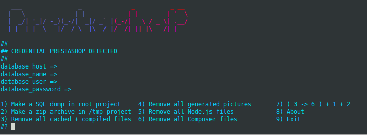

# Backup-Prestashop

**Backup-Prestashop**  allow to reduce the size of the main directory of your Prestashop.
hen make a backup.

- **The script allow you to**:
  - Make a SQL dump in root project
  - Make a zip archive
  - Remove all cached + compiled files
  - Remove all generated pictures
  - Remove all Node.js files
  - Remove all Composer files
  - All together

- **TODO**:
  - Test if can remove img/tmp/*
  - CronJOb
  - Send Archive on Gdrive
  - Set zip compression
  - Clean DB
  - Remove empty dir in img/p
  - Remove more directories following composer.json (eg Prestashop/ps_modules)
  - check if install MozJpeg could improve again the archive weight lost

- **Here what's look like the menu**:

